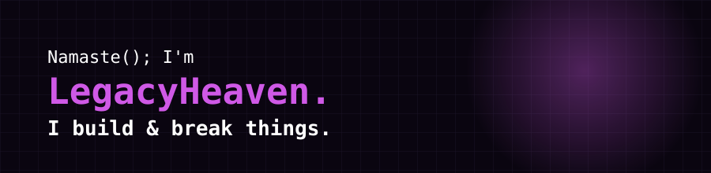

<!--
you're reading the source of a readme. respectable.
the banner above is a hand-written svg, not a generator output.
nothing else to see here. unless you check the bottom of the page.
-->

<div align="center">



</div>

### About Me

I'm LegacyHeaven. I build things for the web, run Minecraft servers on the side, and usually end up managing whatever infrastructure it's all sitting on.

More about me: [legacyheaven.dev](https://legacyheaven.dev)

<br/>

<div align="center">

<!-- QUOTE:START -->
> *"First, solve the problem. Then, write the code. — John Johnson"*
<!-- QUOTE:END -->

</div>

<br/>

### Tech Stack

<div align="center">


</div>

<br/>

### GitHub Stats

<div align="center">


</div>

<br/>

### Connect

<div align="center">

<a href="https://legacyheaven.dev"></a>

<br/><br/>


</div>

<br/>

<details>
<summary>[ sudo cat secrets.txt ]</summary>
<br/>

```
$ whoami
not root, but close enough

$ cat todo.txt
- fix the bug
- bug count: 47 and rising

$ systemctl status minecraft-server
● minecraft-server.service - active (running)
  players online: 3
  players who are actually me testing: 2
```

</details>

---
